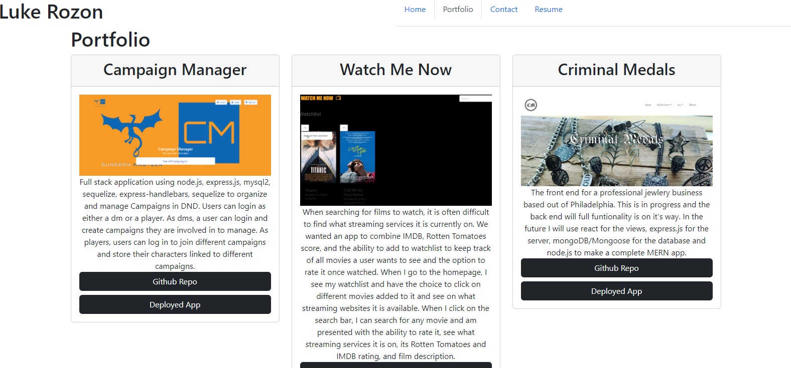

# my-portfolio-react

  ## Table of Contents:
  1. [Description](#description) 
  2. [Installation](#installation)
  3. [Usage](#usage)
  5. [Test Instructions](#testInstructions)
  6. [License](#license)
  7. [Questions](#questions)
  ## Description 

  Personal portfolio page built with React to highlight projects that I have completed. Also contains a contact section and a link to my resume. 

  

  ## Usage 

  for potential employers to have access to my resume, projects and other goodies. 

  ## license 

  MIT

  ## Questions 

  If you have any questions or want to get in touch you can contact me through email

  E-mail: lukerozon@gmail.com

  Github: https://www.github.com/zym0tic

